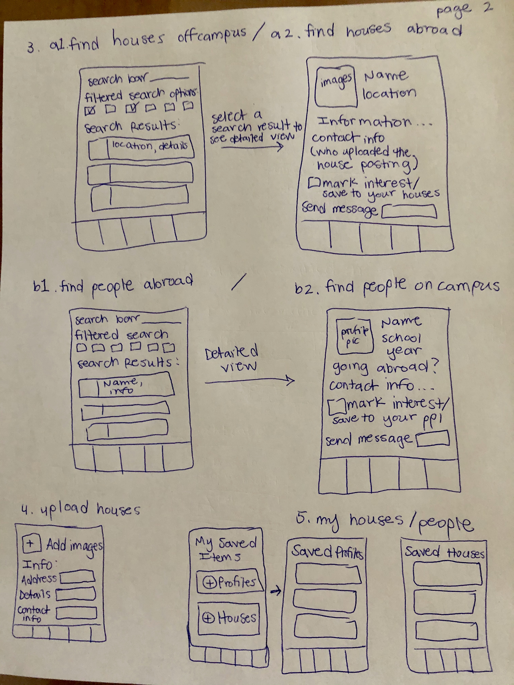

Original App Design Project - README
===
by Helen Paulini
# RoomMatch

## Table of Contents
1. [Overview](#Overview)
1. [Product Spec](#Product-Spec)
1. [Wireframes](#Wireframes)
2. [Schema](#Schema)

## Overview
### Description
This app is for college students looking for housing, whether it be off campus, on campus, or abroad. The app will match users with similar housing interests, which they can then reach out to in order to make housing arrangements or plans for room draw. Students who have previously lived off campus can also input information on their off campus housing information for interested students in the future. Also, for students studying abroad, the app will display other students intending to be in the same abroad program, so that they can connect and find housing abroad together.

### App Evaluation

- **Category:** Planning, Networking, Education
- **Mobile:** This will be a mobile app, as it is meant for students to plan and connect together, and utilize mobile communication/interaction.
- **Story:** Helps to streamline the process of finding housing and people to house with. The app would make it easier for students to share information on housing experiences, and have a more streamlined planning process leading up to room draw.
- **Market:** Any college or university student seeking housing, or wanting to plan their housing arrangements.
- **Habit:** This could be used year round, or whenever students want to plan their housing arrangments. This could be leading up to their school's room draw for the upcoming year, or when looking to connect with students they may room with while abroad, or even when seeking arrangements for off campus housing during the summer or winter breaks.
- **Scope:** V1 could be focused on students studying abroad, and matching students participating in the same program, as well as students who could complete room draw together on campus (i.e. if one student is abroad in the fall and the other is abroad in the spring, they would be compatible to complete room draw together for when they're on campus). V2 could include students who are seeking housing off campus, in which users can see students with similar housing interests/needs, as well as off campus housing options that students have typically used in the past. V3 could be used by any and all students, in which regardless of what type of housing you are looking for, the system will help with your planning and matching process for potential housemates, suitemates, or roommates whether it's on campus, off campus, or abroad.

## Product Spec

### 1. User Stories (Required and Optional)

**Required Must-have Stories**

* User can log in using their school email account, and create a profile (and can edit profile anytime)
* User can specify their housing interests (single, double, suite, on campus, off campus, etc)
* User can specify if and when they're going abroad, and view other users who are participating in the same program as them
* User can view other students and what their housing preferences are, this can be a filtered view
* User can ping students that they are interested in housing with/planning housing with

**Optional Nice-to-have Stories**

* Users can input information on off campus/abroad housing
* Users can view off campus/abroad housing information submitted by others
* Off campus/abroad housing information is supplemented by Google maps API/info, rent info, etc
* Users can match with other users to form groups for housing
* Users can internally message each other within the app
* A resources page/feed, where students can make posts and notify each other about housing information, deadlines, etc

### 2. Screen Archetypes

* Login
   * User logs in with their school email address and password of their choice
* User Profile
   * User can upload a photo
   * User insert their name, school, year, housing preferences, study abroad information (if applicable)
* Dashboard
   * User sees the most latest list of students and houses that meet their housing/roommate preferences
* View other Users
   * View users by school, year, housing preferences, study abroad program
   * Has a filtered search
   * Can tap on a user to view more information on them or "ping" them
* View Housing Options
   * User can see housing options that have been uploaded by other students who are looking for roommates to house off campus with, or housing that will soon be available because students are graduating/moving out
   * Has a filtered search
* Upload Housing Information
   * For off campus/abroad housing, users can input data about housing they found and are interested in living in (but in need of roommates), are currently living in, or have previously lived in
   * Others can view this data, and filter their search on this data
   * Users can tap on a house to view more information, or express interest in a house, or "ping" the current/previous students living their to get more information

### 3. Navigation

**Tab Navigation** (Tab to Screen)

* My Profile
* Find Students
    * Find Study Abroad Matches
    * Find Housing Matches
* Find Houses
* Upload Houses
* My Connections

**Flow Navigation** (Screen to Screen)

* Login -> Dashboard
* Find Students -> View student details
* Find Houses -> View housing details
* View Student details -> connect/match with student
* View House details -> mark interest in house
* Upload Houses -> page to insert images/make house profile -> Updated 'Find Houses' feed

## Wireframes

### Digital Wireframes & Mockups

### Interactive Prototype

## Schema 
[This section will be completed in Unit 9]
### Models
[Add table of models]
### Networking
- [Add list of network requests by screen ]
- [Create basic snippets for each Parse network request]
- [OPTIONAL: List endpoints if using existing API such as Yelp]
